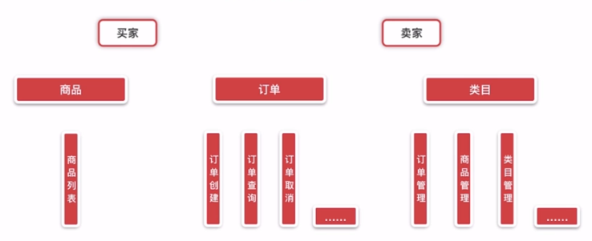
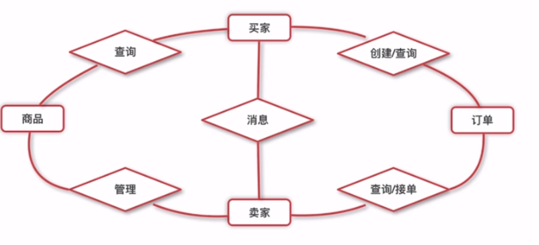
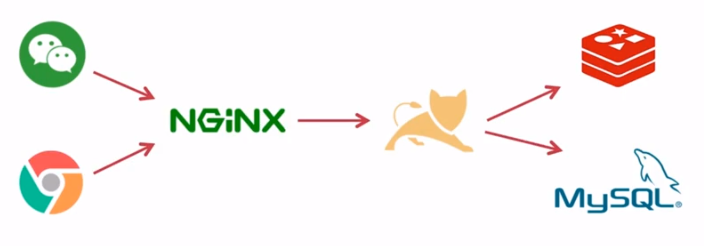
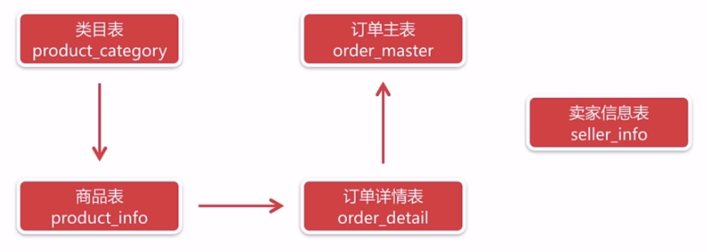

# 项目设计

## 角色划分

- 买家：手机端（微信端）
- 卖家：PC端

## 功能分析



## 关系图



## 部署架构



卖家端和买家端向nginx服务器发送请求，买家端的前端资源放置在nginx服务器上，请求后端接口，nginx服务器会转发给tomcat，如果借口做了缓存，则会从redis中取出数据，否则会从mysql数据库中获取数据。


> 应用支持分布式部署

## 数据库设计



DDL:

```sql
-- 商品表
CREATE TABLE product_info (
  product_id VARCHAR(32) NOT NULL,
  product_name VARCHAR(64) NOT NULL COMMENT '商品名称',
  product_price DECIMAL(8,2) NOT NULL COMMENT '商品单价',
  product_stock INT NOT NULL COMMENT '库存',
  product_description VARCHAR(64) COMMENT '描述',
  product_icon VARCHAR(512) COMMENT '小图片链接',
  category_type int not null COMMENT '类目编号',
  create_time TIMESTAMP NOT NULL DEFAULT CURRENT_TIMESTAMP COMMENT '创建时间',
  update_time TIMESTAMP NOT NULL DEFAULT CURRENT_TIMESTAMP ON UPDATE CURRENT_TIMESTAMP COMMENT '更新时间',
  PRIMARY KEY (product_id)
) comment '商品表';

-- 类目表
CREATE TABLE product_category (
  category_id INT NOT NULL AUTO_INCREMENT,
  category_name VARCHAR (64) NOT NULL COMMENT '类目名称',
  category_type INT NOT NULL comment '类目编号',
  create_time TIMESTAMP NOT NULL DEFAULT CURRENT_TIMESTAMP COMMENT '创建时间',
  update_time TIMESTAMP NOT NULL DEFAULT CURRENT_TIMESTAMP ON UPDATE CURRENT_TIMESTAMP COMMENT '更新时间',
  PRIMARY KEY (category_id),
  UNIQUE KEY uqe_category_type (category_type)
) comment '类目表';

-- 订单主表
CREATE TABLE order_master (
  order_id VARCHAR(32) NOT NULL ,
  buyer_name VARCHAR(32) NOT NULL COMMENT '买家名字',
  buyer_phone VARCHAR(32) NOT NULL COMMENT '买家电话',
  buyer_address VARCHAR(128) NOT NULL COMMENT '买家地址',
  buyer_openid VARCHAR(64) NOT NULL COMMENT '买家微信openid',
  order_amount DECIMAL(8,2) NOT NULL COMMENT '订单总金额',
  order_status TINYINT(3) NOT NULL DEFAULT '0' COMMENT '订单状态，默认0新下单',
  pay_status TINYINT(3) NOT NULL DEFAULT '0' COMMENT '支付状态，默认0未支付',
  create_time TIMESTAMP NOT NULL DEFAULT CURRENT_TIMESTAMP COMMENT '创建时间',
  update_time TIMESTAMP NOT NULL DEFAULT CURRENT_TIMESTAMP ON UPDATE CURRENT_TIMESTAMP COMMENT '更新时间',
  PRIMARY KEY (order_id), 
  KEY idx_buyer_openid (buyer_openid)
) comment '订单主表';

-- 订单详情表
CREATE TABLE order_detail(
  detail_id VARCHAR(32) NOT NULL ,
  order_id VARCHAR(32) NOT NULL,
  product_id VARCHAR(32) NOT NULL,
  product_name VARCHAR(64) NOT NULL COMMENT '商品名称',
  product_price DECIMAL(8,2) NOT NULL COMMENT '商品价格',
  product_quantity INT NOT NULL COMMENT '商品数量',
  product_icon VARCHAR(512) COMMENT '商品图片',
  create_time TIMESTAMP NOT NULL DEFAULT CURRENT_TIMESTAMP COMMENT '创建时间',
  update_time TIMESTAMP NOT NULL DEFAULT CURRENT_TIMESTAMP ON UPDATE CURRENT_TIMESTAMP COMMENT '更新时间',
  PRIMARY KEY(detail_id),
  KEY idx_order_id(order_id)
) COMMENT '订单详情表';
```

# 日志使用

## 什么是日志框架

是一套实现日志输出的工具包，能够描述系统运行状态的都称作日志，比如用户下线、接口超时、数据库崩溃...

一个日志框架有以下能力：

- 定制输出目标
- 定制输出格式
- 携带的上下文信息（时间戳、线程、路径、调用对象）
- 运行时选择输出（只输出错误，只输出dao层信息）
- 灵活配置

## 日志框架选择

日志规范：
- JCL
- SLF4j
- jboss-logging

日志实现：
- JUL
- Log4j
- Log4j2
- Logback

最优秀，最通用 logback
## Logback使用和配置